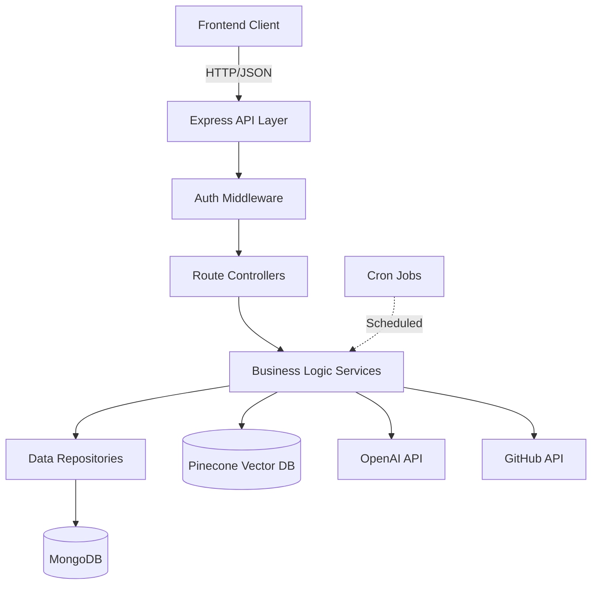

# ProdigyPM Backend Design Document

## Overview

The ProdigyPM backend is a Node.js Express application that provides REST APIs, AI-powered assistance, and GitHub integration for an intelligent project management system. The architecture follows a layered approach with clear separation between API routes, business logic, data access, and external integrations.

### Technology Stack

- **Runtime**: Node.js 18+ with TypeScript
- **Web Framework**: Express.js
- **Database**: MongoDB with Mongoose ODM
- **AI/ML**: OpenAI GPT-4o API + LangChain
- **Vector Database**: Pinecone (primary) with FAISS fallback option
- **Authentication**: JWT (jsonwebtoken) + Passport.js for GitHub OAuth2
- **Background Jobs**: node-cron
- **Logging**: Winston
- **Validation**: Joi
- **HTTP Client**: Axios
- **Environment**: dotenv

## Architecture

### High-Level Architecture Diagram



### Layered Architecture

```
┌─────────────────────────────────────────┐
│         API Layer (Routes)              │
│  - Authentication routes                │
│  - Project/Issue/Sprint CRUD routes     │
│  - AI Assistant routes                  │
│  - GitHub Integration routes            │
└─────────────────────────────────────────┘
                    ↓
┌─────────────────────────────────────────┐
│      Middleware Layer                   │
│  - JWT Authentication                   │
│  - Request Validation                   │
│  - Error Handling                       │
│  - Rate Limiting                        │
│  - Logging                              │
└─────────────────────────────────────────┘
                    ↓
┌─────────────────────────────────────────┐
│      Service Layer (Business Logic)     │
│  - AuthService                          │
│  - ProjectService                       │
│  - AIService                            │
│  - GitHubService                        │
│  - EmbeddingService                     │
└─────────────────────────────────────────┘
                    ↓
┌─────────────────────────────────────────┐
│      Repository Layer (Data Access)     │
│  - UserRepository                       │
│  - ProjectRepository                    │
│  - IssueRepository                      │
│  - SprintRepository                     │
│  - GitHubRepoRepository                 │
└─────────────────────────────────────────┘
                    ↓
┌─────────────────────────────────────────┐
│         Data Layer                      │
│  - MongoDB (Primary Data)               │
│  - Pinecone (Vector Embeddings)         │
└─────────────────────────────────────────┘
```

## Components and Interfaces

### 1. API Routes

#### Authentication Routes (`/api/auth`)

```typescript
POST   /api/auth/register
POST   /api/auth/login
POST   /api/auth/refresh
GET    /api/auth/github
GET    /api/auth/github/callback
POST   /api/auth/logout
```

#### Project Routes (`/api/projects`)

```typescript
GET    /api/projects              // List user's projects
POST   /api/projects              // Create project
GET    /api/projects/:id          // Get project details
PUT    /api/projects/:id          // Update project
DELETE /api/projects/:id          // Delete project
```

#### Issue Routes (`/api/projects/:projectId/issues`)

```typescript
GET    /api/projects/:projectId/issues           // List issues
POST   /api/projects/:projectId/issues           // Create issue
GET    /api/projects/:projectId/issues/:id       // Get issue
PUT    /api/projects/:projectId/issues/:id       // Update issue
DELETE /api/projects/:projectId/issues/:id       // Delete issue
```

#### Sprint Routes (`/api/projects/:projectId/sprints`)

```typescript
GET    /api/projects/:projectId/sprints          // List sprints
POST   /api/projects/:projectId/sprints          // Create sprint
GET    /api/projects/:projectId/sprints/:id      // Get sprint
PUT    /api/projects/:projectId/sprints/:id      // Update sprint
DELETE /api/projects/:projectId/sprints/:id      // Delete sprint
```

#### AI Assistant Routes (`/api/ai`)

```typescript
POST   /api/ai/generate-stories    // Generate user stories from goal
POST   /api/ai/sprint-summary       // Generate sprint summary
POST   /api/ai/prioritize-backlog   // Prioritize backlog items
POST   /api/ai/github-insights      // Generate GitHub insights
```

#### GitHub Integration Routes (`/api/github`)

```typescript
GET    /api/github/repos            // List connected repositories
POST   /api/github/repos/connect    // Connect a repository
DELETE /api/github/repos/:id        // Disconnect repository
POST   /api/github/repos/:id/sync   // Trigger manual sync
GET    /api/github/repos/:id/data   // Get synced repository data
```

### 2. Middleware Components

#### Authentication Middleware

```typescript
interface AuthMiddleware {
  verifyToken(req: Request, res: Response, next: NextFunction): void;
  extractUser(req: Request): User;
}
```

**Responsibilities:**
- Verify JWT token from Authorization header
- Extract user information and attach to request
- Return 401 for invalid/expired tokens

#### Validation Middleware

```typescript
interface ValidationMiddleware {
  validateBody(schema: Joi.Schema): RequestHandler;
  validateParams(schema: Joi.Schema): RequestHandler;
  validateQuery(schema: Joi.Schema): RequestHandler;
}
```

**Responsibilities:**
- Validate request payloads against Joi schemas
- Return 400 with field-level errors on validation failure
- Sanitize input to prevent injection attacks

#### Rate Limiting Middleware

```typescript
interface RateLimitConfig {
  windowMs: number;
  maxRequests: number;
  keyGenerator: (req: Request) => string;
}
```

**Responsibilities:**
- Track requests per user per time window
- Return 429 when limit exceeded
- Use in-memory store with Redis option for production

#### Error Handling Middleware

```typescript
interface ErrorHandler {
  handleError(err: Error, req: Request, res: Response, next: NextFunction): void;
  formatError(err: Error): ErrorResponse;
}

interface ErrorResponse {
  code: string;
  message: string;
  correlationId: string;
  details?: any;
}
```

### 3. Service Layer

#### AuthService

```typescript
interface AuthService {
  register(email: string, password: string, name: string): Promise<User>;
  login(email: string, password: string): Promise<{ user: User; token: string }>;
  generateToken(userId: string): string;
  verifyToken(token: string): { userId: string };
  initiateGitHubOAuth(): string;
  handleGitHubCallback(code: string): Promise<{ accessToken: string; repos: GitHubRepo[] }>;
}
```

#### ProjectService

```typescript
interface ProjectService {
  createProject(userId: string, data: CreateProjectDto): Promise<Project>;
  getProject(projectId: string, userId: string): Promise<Project>;
  listProjects(userId: string, pagination: PaginationDto): Promise<PaginatedResult<Project>>;
  updateProject(projectId: string, userId: string, data: UpdateProjectDto): Promise<Project>;
  deleteProject(projectId: string, userId: string): Promise<void>;
}
```

#### IssueService

```typescript
interface IssueService {
  createIssue(projectId: string, data: CreateIssueDto): Promise<Issue>;
  getIssue(issueId: string): Promise<Issue>;
  listIssues(projectId: string, filters: IssueFilters): Promise<Issue[]>;
  updateIssue(issueId: string, data: UpdateIssueDto): Promise<Issue>;
  deleteIssue(issueId: string): Promise<void>;
  assignToSprint(issueId: string, sprintId: string): Promise<Issue>;
}
```

#### SprintService

```typescript
interface SprintService {
  createSprint(projectId: string, data: CreateSprintDto): Promise<Sprint>;
  getSprint(sprintId: string): Promise<Sprint>;
  listSprints(projectId: string): Promise<Sprint[]>;
  updateSprint(sprintId: string, data: UpdateSprintDto): Promise<Sprint>;
  deleteSprint(sprintId: string): Promise<void>;
  getSprintIssues(sprintId: string): Promise<Issue[]>;
}
```

#### AIService

```typescript
interface AIService {
  generateUserStories(goal: string, projectContext: ProjectContext): Promise<UserStory[]>;
  generateSprintSummary(sprintId: string): Promise<SprintSummary>;
  prioritizeBacklog(projectId: string): Promise<PrioritizedIssue[]>;
  generateGitHubInsights(repoId: string, sprintId?: string): Promise<GitHubInsights>;
}

interface UserStory {
  title: string;
  description: string;
  acceptanceCriteria: string[];
}

interface SprintSummary {
  completionPercentage: number;
  blockedCount: number;
  accomplishments: string[];
  risks: string[];
  githubActivity?: string;
}

interface PrioritizedIssue {
  issueId: string;
  priorityScore: number;
  reasoning: string;
}

interface GitHubInsights {
  activitySummary: string;
  metrics: {
    commitsPerDay: number;
    avgPRMergeTime: number;
    openIssueCount: number;
  };
  sprintAlignment?: string;
  releaseReadiness?: string;
}
```

#### GitHubService

```typescript
interface GitHubService {
  connectRepository(userId: string, repoFullName: string, accessToken: string): Promise<GitHubRepo>;
  disconnectRepository(repoId: string): Promise<void>;
  syncRepository(repoId: string): Promise<SyncResult>;
  getRepositoryData(repoId: string): Promise<GitHubData>;
  fetchCommits(repoFullName: string, accessToken: string, since: Date): Promise<Commit[]>;
  fetchPullRequests(repoFullName: string, accessToken: string): Promise<PullRequest[]>;
  fetchIssues(repoFullName: string, accessToken: string): Promise<GitHubIssue[]>;
}

interface SyncResult {
  success: boolean;
  commitCount: number;
  prCount: number;
  issueCount: number;
  lastSyncTime: Date;
}
```

#### EmbeddingService

```typescript
interface EmbeddingService {
  generateEmbedding(text: string): Promise<number[]>;
  storeEmbedding(embedding: number[], metadata: EmbeddingMetadata): Promise<string>;
  searchSimilar(queryEmbedding: number[], topK: number): Promise<SimilarityResult[]>;
  deleteEmbeddings(filter: EmbeddingFilter): Promise<void>;
}

interface EmbeddingMetadata {
  sourceType: 'issue' | 'commit' | 'pr' | 'github_issue';
  sourceId: string;
  projectId?: string;
  repoId?: string;
  timestamp: Date;
}

interface SimilarityResult {
  id: string;
  score: number;
  metadata: EmbeddingMetadata;
  text: string;
}
```

### 4. Repository Layer

#### UserRepository

```typescript
interface UserRepository {
  create(data: CreateUserData): Promise<User>;
  findById(id: string): Promise<User | null>;
  findByEmail(email: string): Promise<User | null>;
  update(id: string, data: Partial<User>): Promise<User>;
  delete(id: string): Promise<void>;
}
```

#### ProjectRepository

```typescript
interface ProjectRepository {
  create(data: CreateProjectData): Promise<Project>;
  findById(id: string): Promise<Project | null>;
  findByUserId(userId: string, pagination: Pagination): Promise<Project[]>;
  update(id: string, data: Partial<Project>): Promise<Project>;
  delete(id: string): Promise<void>;
  countByUserId(userId: string): Promise<number>;
}
```

#### IssueRepository

```typescript
interface IssueRepository {
  create(data: CreateIssueData): Promise<Issue>;
  findById(id: string): Promise<Issue | null>;
  findByProjectId(projectId: string, filters?: IssueFilters): Promise<Issue[]>;
  findBySprintId(sprintId: string): Promise<Issue[]>;
  update(id: string, data: Partial<Issue>): Promise<Issue>;
  delete(id: string): Promise<void>;
  deleteByProjectId(projectId: string): Promise<void>;
}
```

#### SprintRepository

```typescript
interface SprintRepository {
  create(data: CreateSprintData): Promise<Sprint>;
  findById(id: string): Promise<Sprint | null>;
  findByProjectId(projectId: string): Promise<Sprint[]>;
  update(id: string, data: Partial<Sprint>): Promise<Sprint>;
  delete(id: string): Promise<void>;
  deleteByProjectId(projectId: string): Promise<void>;
}
```

#### GitHubRepoRepository

```typescript
interface GitHubRepoRepository {
  create(data: CreateGitHubRepoData): Promise<GitHubRepo>;
  findById(id: string): Promise<GitHubRepo | null>;
  findByUserId(userId: string): Promise<GitHubRepo[]>;
  update(id: string, data: Partial<GitHubRepo>): Promise<GitHubRepo>;
  delete(id: string): Promise<void>;
  findAllActive(): Promise<GitHubRepo[]>;
}
```

## Data Models

### User Model

```typescript
interface User {
  _id: string;
  email: string;
  password: string; // bcrypt hashed
  name: string;
  githubAccessToken?: string; // encrypted
  createdAt: Date;
  updatedAt: Date;
}
```

**Indexes:**
- `email` (unique)

### Project Model

```typescript
interface Project {
  _id: string;
  userId: string;
  name: string;
  description: string;
  status: 'active' | 'archived';
  connectedRepos: string[]; // GitHubRepo IDs
  createdAt: Date;
  updatedAt: Date;
}
```

**Indexes:**
- `userId`
- `userId, status`

### Issue Model

```typescript
interface Issue {
  _id: string;
  projectId: string;
  sprintId?: string;
  title: string;
  description: string;
  type: 'story' | 'task' | 'bug';
  status: 'backlog' | 'todo' | 'in_progress' | 'done';
  priority: 'low' | 'medium' | 'high' | 'critical';
  priorityScore?: number; // AI-generated score 1-100
  assignee?: string;
  estimatedHours?: number;
  acceptanceCriteria: string[];
  embeddingId?: string; // Pinecone vector ID
  createdAt: Date;
  updatedAt: Date;
}
```

**Indexes:**
- `projectId`
- `sprintId`
- `projectId, status`
- `projectId, priority`

### Sprint Model

```typescript
interface Sprint {
  _id: string;
  projectId: string;
  name: string;
  goal: string;
  startDate: Date;
  endDate: Date;
  status: 'planned' | 'active' | 'completed';
  createdAt: Date;
  updatedAt: Date;
}
```

**Indexes:**
- `projectId`
- `projectId, status`

### GitHubRepo Model

```typescript
interface GitHubRepo {
  _id: string;
  userId: string;
  fullName: string; // e.g., "owner/repo"
  accessToken: string; // encrypted
  isActive: boolean;
  lastSyncTime?: Date;
  syncStatus: 'pending' | 'syncing' | 'success' | 'failed';
  syncError?: string;
  commits: Commit[];
  pullRequests: PullRequest[];
  issues: GitHubIssue[];
  createdAt: Date;
  updatedAt: Date;
}

interface Commit {
  sha: string;
  message: string;
  author: string;
  date: Date;
  embeddingId?: string;
}

interface PullRequest {
  number: number;
  title: string;
  state: 'open' | 'closed' | 'merged';
  author: string;
  createdAt: Date;
  mergedAt?: Date;
  embeddingId?: string;
}

interface GitHubIssue {
  number: number;
  title: string;
  state: 'open' | 'closed';
  author: string;
  createdAt: Date;
  closedAt?: Date;
  embeddingId?: string;
}
```

**Indexes:**
- `userId`
- `userId, isActive`
- `fullName` (unique)

## Error Handling

### Error Types

```typescript
class AppError extends Error {
  constructor(
    public statusCode: number,
    public code: string,
    public message: string,
    public details?: any
  ) {
    super(message);
  }
}

class ValidationError extends AppError {
  constructor(message: string, details: any) {
    super(400, 'VALIDATION_ERROR', message, details);
  }
}

class AuthenticationError extends AppError {
  constructor(message: string = 'Authentication failed') {
    super(401, 'AUTHENTICATION_ERROR', message);
  }
}

class AuthorizationError extends AppError {
  constructor(message: string = 'Access denied') {
    super(403, 'AUTHORIZATION_ERROR', message);
  }
}

class NotFoundError extends AppError {
  constructor(resource: string) {
    super(404, 'NOT_FOUND', `${resource} not found`);
  }
}

class ExternalServiceError extends AppError {
  constructor(service: string, message: string) {
    super(503, 'EXTERNAL_SERVICE_ERROR', `${service}: ${message}`);
  }
}
```

### Error Response Format

```typescript
interface ErrorResponse {
  error: {
    code: string;
    message: string;
    correlationId: string;
    details?: any;
  };
}
```

### Error Handling Strategy

1. **Validation Errors**: Return 400 with field-level details
2. **Authentication Errors**: Return 401 with generic message
3. **Authorization Errors**: Return 403 when user lacks permission
4. **Not Found Errors**: Return 404 for missing resources
5. **External Service Errors**: Return 503 with retry-after header
6. **Unexpected Errors**: Return 500 with correlation ID, log full stack trace

**Key Scenarios**:
1. User registration → project creation → issue creation → AI story generation
2. GitHub OAuth → repository connection → sync → insights generation
3. Sprint creation → issue assignment → sprint summary generation
4. Backlog prioritization with vector similarity search

## Security Considerations

### Authentication & Authorization

1. **Password Security**:
   - Use bcrypt with 10+ salt rounds
   - Enforce minimum password length of 8 characters
   - Never log or expose passwords

2. **JWT Security**:
   - Use strong secret key (256-bit minimum)
   - Set reasonable expiration (24 hours)
   - Include user ID and issued-at claims
   - Validate signature on every request

3. **GitHub Token Security**:
   - Encrypt tokens before database storage using AES-256
   - Store encryption key in environment variable
   - Never expose tokens in API responses or logs

### Input Validation

1. **Request Validation**:
   - Validate all inputs against Joi schemas
   - Sanitize strings to prevent NoSQL injection
   - Limit string lengths to prevent DoS
   - Validate email formats and URL formats

2. **Rate Limiting**:
   - 100 requests per minute per user for standard endpoints
   - 10 requests per minute for AI endpoints
   - 5 requests per minute for GitHub sync endpoints

### Data Access Control

1. **Authorization Checks**:
   - Verify user owns project before any project operation
   - Verify project ownership before issue/sprint operations
   - Verify repository ownership before sync operations

2. **Query Filtering**:
   - Always filter by userId in repository queries
   - Never expose other users' data
   - Use MongoDB projection to exclude sensitive fields

## Performance Optimization

### Database Optimization

1. **Indexing Strategy**:
   - Create compound indexes for common query patterns
   - Use sparse indexes for optional fields
   - Monitor slow queries with MongoDB profiler

2. **Query Optimization**:
   - Use lean() for read-only queries
   - Implement pagination for list endpoints
   - Use select() to limit returned fields
   - Avoid N+1 queries with populate()

### Caching Strategy

1. **GitHub Data Caching**:
   - Cache repository data for 15 minutes
   - Invalidate cache on manual sync
   - Use in-memory cache (node-cache) for simplicity

2. **AI Response Caching**:
   - Cache identical AI requests for 1 hour
   - Use request hash as cache key
   - Store in Redis for production

### Background Job Optimization

1. **Sync Job Strategy**:
   - Run every 15 minutes
   - Process repositories sequentially to avoid rate limits
   - Implement exponential backoff on failures
   - Skip inactive repositories

2. **Embedding Generation**:
   - Batch embed multiple texts in single API call
   - Queue embedding jobs to avoid blocking requests
   - Generate embeddings asynchronously after entity creation

## Deployment Architecture

### Environment Variables

```bash
# Server
NODE_ENV=production
PORT=3000
API_BASE_URL=https://api.prodigypm.com

# Database
MONGODB_URI=mongodb+srv://...
MONGODB_DB_NAME=prodigypm

# Authentication
JWT_SECRET=<256-bit-secret>
JWT_EXPIRATION=24h
ENCRYPTION_KEY=<256-bit-key>

# GitHub OAuth
GITHUB_CLIENT_ID=<client-id>
GITHUB_CLIENT_SECRET=<client-secret>
GITHUB_CALLBACK_URL=https://api.prodigypm.com/api/auth/github/callback

# OpenAI
OPENAI_API_KEY=<api-key>
OPENAI_MODEL=gpt-4o

# Pinecone
PINECONE_API_KEY=<api-key>
PINECONE_ENVIRONMENT=<environment>
PINECONE_INDEX_NAME=prodigypm-embeddings

# Logging
LOG_LEVEL=info
```

### Deployment Checklist

1. Set all environment variables
2. Enable MongoDB connection pooling
3. Configure CORS for frontend domain
4. Enable compression middleware
5. Set up health check endpoint (`/health`)
6. Configure log aggregation (e.g., LogDNA, Datadog)
7. Set up error monitoring (e.g., Sentry)
8. Enable HTTPS only
9. Configure rate limiting
10. Set up automated backups for MongoDB

### Monitoring & Observability

1. **Health Checks**:
   - `/health` - Basic server health
   - `/health/db` - MongoDB connection status
   - `/health/ai` - OpenAI API availability
   - `/health/vector` - Pinecone connection status

2. **Metrics to Track**:
   - Request rate and latency (p50, p95, p99)
   - Error rate by endpoint
   - AI request latency and token usage
   - GitHub API rate limit remaining
   - Database query performance
   - Background job success rate

3. **Logging Strategy**:
   - Use structured JSON logging
   - Include correlation IDs for request tracing
   - Log levels: ERROR, WARN, INFO, DEBUG
   - Separate log streams for application and access logs
